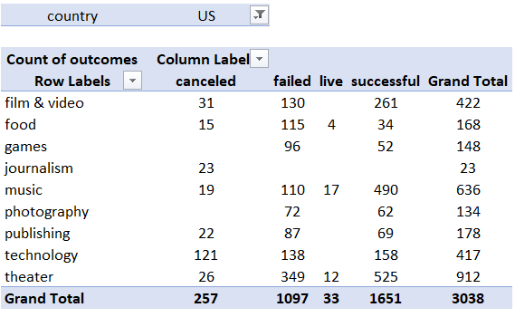
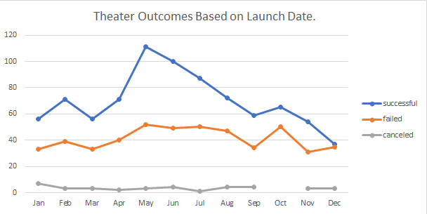
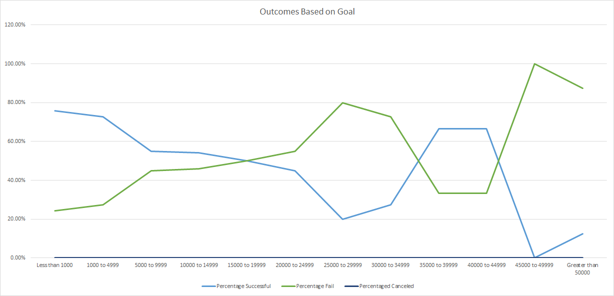
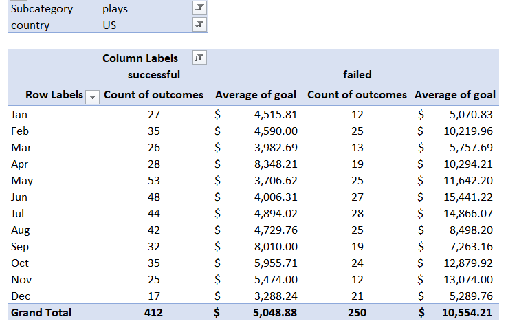
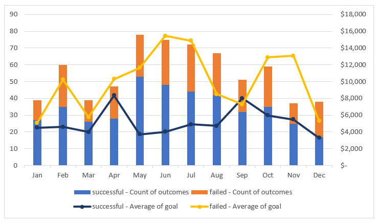

# Kickstarting with Excel

## *Overview of Project*

  This project aims to help Louise, an playwright who started a crowd funding to obtain funds for her play "Fever", to comprehend how the launch date of campaigns and their funding goal have an impact on the success or failing of their fundraising.
We will reach our goal through an analysis of a dataset containing specific information of different campaigns around the world, using excel and a few graphics.

## *Purpose*

  Providing Louise a better understanding about how certain fundraising campaigns are affected depending on the launch dates and the funding goals each one of them has.

## *Analysis and Challenges*

  For doing this analysis a review of the database was needed, to give awareness of what type of information was in it and how it was related to one another. 
  In this recognition state of the data, it was also necessary to do some modifications and transformations in a way that it could be used for the analysis. One of the challenges it came up when doing this was that the data about the launch and end date of the fundraisings came in a Timestamps format. However, after the conversion was made, this information was also useful.
  To help reviewing the data, Pivot Tables had been created, for afterwards using them to build some of the graphics you will see in this report.
  
  An example of these Pivot Tables, below. 

This table helped to notice that the category Louise is more interested in, Theater, is the one that has more successful campaigns in the US.

### *Analysis of Outcomes Based on Launch Date*
 

Having selected the Theater category on our data and analyze in which month each one of their campaigns were started, we can see that more fundraisings were successful and reach their goal by starting in May and followed by June. This is not the case with December, unlike what was just mentioned, given that these campaigns seem to be needing to do a bigger effort to reach their goals.

### *Analysis of Outcomes Based on Goals*
 
 
 
For this analysis it was taken into consideration the projects that were successful, canceled ones and the ones that failed, and they were distributed into segments that were created depending on the amount of the goal. In that way, it was possible to came up with the percentage of the outcome of the campaigns that relays on their goal.

## *Results*

To reinforce the conclusion I came up with, I did an extra Pivot Table and a chart. The ones you can see below.

These show us that among all the successful plays in the US, the ones in May and June (The months we concluded were the best for starting a fundraise campaign) had a combination of the time were the campaign started but also the goal that they had.
The average of this goal did not exceed USD 4.000, being this not a high one comparing all the others.

**What are two conclusions you can draw about the Outcomes based on Launch Date?**
1. Based on the analyze I can say that the best time of the year to start a fundraiser campaign is close to the middle of the year, since May and June seems to be the best months for doing so.
2. Whereas months close to the beginning of the year but specially the end of the year that has less than 40% probability of being successful, appear to present more difficulties in doing so. This could possibly be related to the increase in the spending of people near the holidays, which would make them not to contribute in the same way that they would in previous months.

**What can you conclude about the Outcomes based on Goals?**

Having had a closer look on how the goal amount impacts in the result of the fundraising, is sure to say that plays with lower goals have more chance of being successful in its campaigns rather than the ones with higher amounts.

**What are some limitations of this dataset?**

I did not find any real limitation regarding the dataset. 

